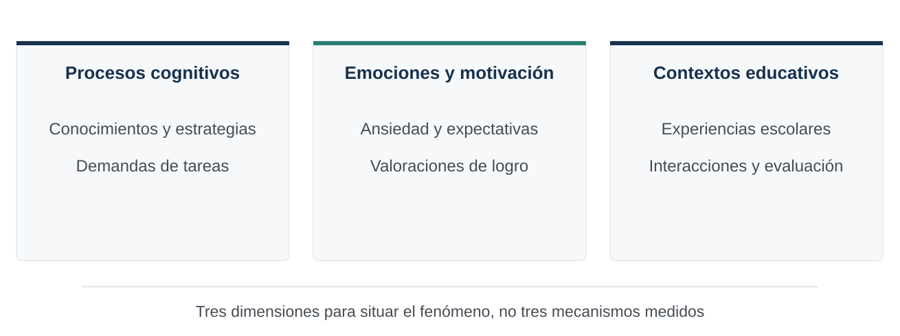
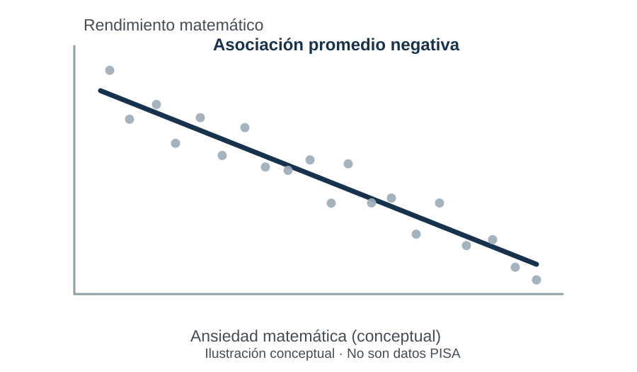
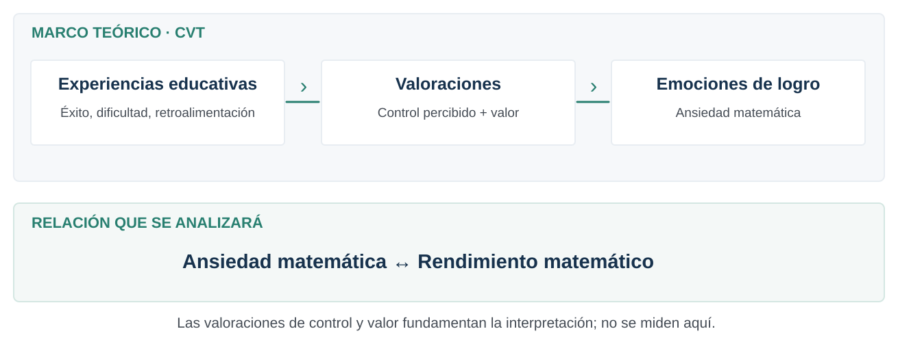
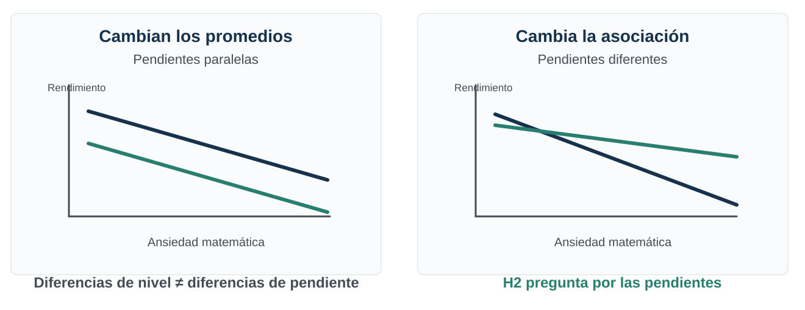
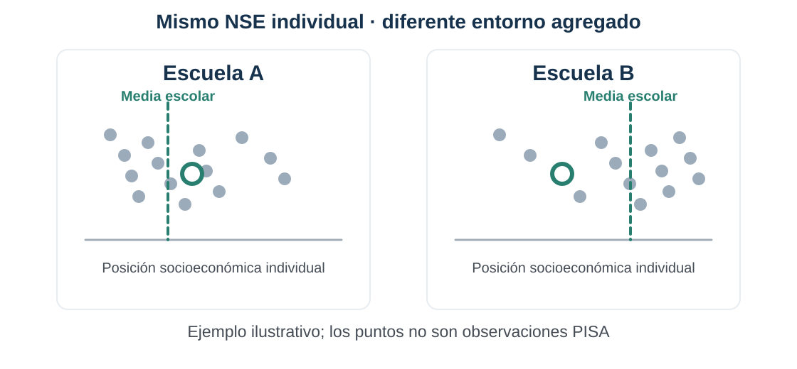
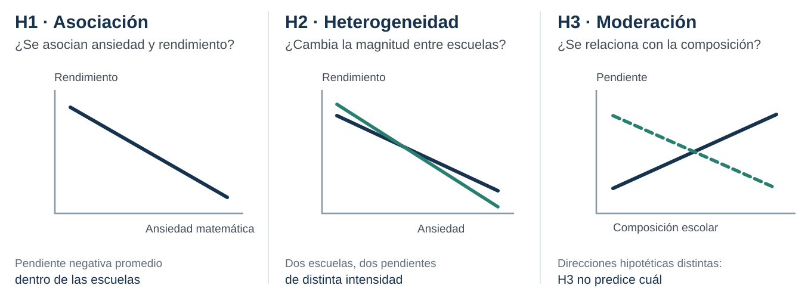
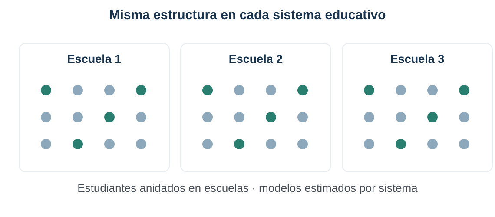
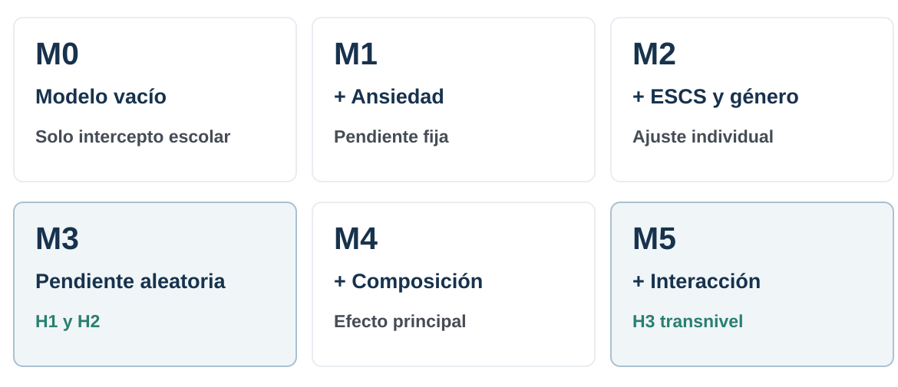
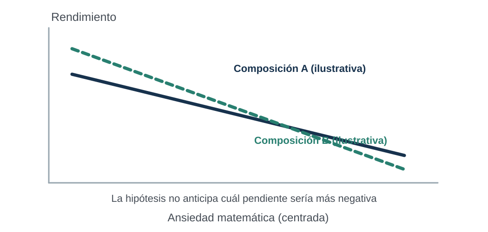

## Diapositiva 01 {#diapositiva-01}

TÍTULO Y RESUMEN

<h2 class="slide-title">Proyecto de tesis · PISA 2022</h2>

Ansiedad matemática, rendimiento y composición escolar

13 sistemas educativos de América Latina y el Caribe · PISA 2022

Katherine Aravena Herrera Magíster en Psicología Educacional · Universidad de Chile Seminario de Investigación II · Guía: Lorena Ortega Profesora: Natalia Albornoz

01

::: {.notes}
Tiempo 0:20. Presentaré el proyecto de tesis sobre ansiedad matemática y rendimiento, con atención a la composición socioeconómica de las escuelas. Lo central es comprender si una relación conocida tiene distinta magnitud dependiendo de la escuela. Utilizaré PISA 2022 y estimaciones por sistema educativo. Antes de explicar cómo lo haré, comenzaré por construir la pregunta desde el problema educativo.
:::

## Diapositiva 02 {#diapositiva-02}

TÍTULO Y RESUMEN

<h2 class="slide-title">El proyecto en una mirada</h2>

<strong>Problema</strong>Ansiedad matemática y rendimiento

<strong>Pregunta</strong>¿La asociación cambia entre escuelas?

<strong>Método</strong>PISA 2022 · modelos multinivel por sistema

Foco contextual: composición socioeconómica escolar, distinta del NSE individual.

02

::: {.notes}
Tiempo 0:30. El problema psicológico-educacional no se agota en constatar que estudiantes con más ansiedad matemática suelen rendir menos. Interesa comprender una relación entre una emoción vinculada al aprendizaje y el desempeño dentro de escuelas socialmente diferenciadas. Estudiaremos primero su asociación promedio y después preguntaremos si varía entre escuelas y si la composición socioeconómica se relaciona con esa variación. Los datos son PISA 2022; la explicación teórica irá antes de los modelos. Transición: mostraré el recorrido de la presentación.
:::

## Diapositiva 03 {#diapositiva-03}

TÍTULO Y RESUMEN

<h2 class="slide-title">Recorrido de la presentación</h2>

01Introducción: construir el problema

02Antecedentes: qué sabemos y qué falta

03Pregunta, objetivos e hipótesis

04Método: cómo estudiaremos la pregunta

05Contribución y cierre

Los aspectos formales se cuidan transversalmente. Los anexos técnicos aparecen después del cierre.

03

::: {.notes}
Tiempo 0:15. La exposición sigue la pauta: comenzaremos con la relevancia psicológico-educacional, pasaremos a teoría y evidencia, formularemos la pregunta e hipótesis y después mostraremos cómo la estrategia multinivel permite examinarlas. Los anexos, con detalle técnico, permanecen tras el cierre. Transición: el aprendizaje matemático es también una experiencia psicológica.
:::

## Diapositiva 04 {#diapositiva-04}

INTRODUCCIÓN

<h2 class="slide-title">El aprendizaje matemático también es una experiencia psicológica</h2>

La Psicología Educacional estudia cómo se aprende y se participa en experiencias educativas, no solo los puntajes obtenidos.

Pekrun (2024); Soderstrom & Bjork (2015)04

::: {.notes}
Tiempo 0:55. Introduzco la investigación desde la Psicología Educacional. En matemáticas importan conocimientos, estrategias y exigencias cognitivas, pero también las emociones con las que se enfrentan las tareas y las experiencias escolares donde ocurre esa actividad. No sostengo que esta tesis mida todos esos procesos: el gráfico sitúa el problema disciplinar. Nuestro estudio observa una emoción específica, la ansiedad matemática, y un resultado educativo, el rendimiento, en escuelas que tienen composiciones socioeconómicas distintas. Transición: antes de centrarnos en esa experiencia emocional, importa recordar por qué el rendimiento matemático es una cuestión educativa relevante.
:::

## Diapositiva 05 {#diapositiva-05}

INTRODUCCIÓN

<h2 class="slide-title">El rendimiento matemático revela desigualdades educativas</h2>

Las matemáticas participan en trayectorias educativas y oportunidades de aprendizaje.

PISA 2022 documenta diferencias de rendimiento asociadas con condiciones socioeconómicas.

PISA 2022

Matemáticas: dominio principal

Un puntaje expresa desempeño en una evaluación; no resume toda la experiencia de aprender.

OECD (2023a); BID et al. (2024)05

::: {.notes}
Tiempo 0:40. Matemáticas importa para las trayectorias educativas y PISA 2022 documenta importantes diferencias de desempeño. Aquí interesa separar rendimiento medido de aprendizaje y de experiencias educativas: una evaluación captura una actuación bajo ciertas condiciones. Por eso, desde la Psicología Educacional, no basta con describir puntajes; importa preguntar qué ocurre en el plano emocional cuando se aprende, usa o rinde una evaluación matemática. Transición: ahí aparece la ansiedad matemática.
:::

## Diapositiva 06 {#diapositiva-06}

INTRODUCCIÓN

<h2 class="slide-title">Ansiedad matemática: una emoción vinculada al aprendizaje</h2>

Ansiedad matemática

Tensión, preocupación o aprensión ante situaciones que implican aprender, utilizar o ser evaluado en matemáticas.

Experiencia específica del dominio; distinta de la ansiedad general.

Asociación negativa promedio, no causalidad.

Ashcraft (2002); Barroso et al. (2021); Caviola et al. (2022)06

::: {.notes}
Tiempo 0:55. Ansiedad matemática nombra tensión, preocupación o aprensión ante tareas del dominio matemático. Es relevante porque involucra cómo se vive la actividad académica, no solo una disposición personal general. Metaanálisis encuentran una asociación promedio negativa con rendimiento; la flecha visual indica una asociación y no una vía causal demostrada. Tanto la preocupación que acompaña la ejecución como experiencias previas de dificultad son interpretaciones discutidas en la literatura. A continuación revisaremos qué establece la evidencia y qué cuestiones siguen abiertas antes de plantear posibles diferencias entre escuelas.
:::

## Diapositiva 07 {#diapositiva-07}

ANTECEDENTES TEÓRICOS Y EMPÍRICOS

<h2 class="slide-title">Qué sabemos sobre ansiedad matemática y rendimiento</h2>

<b>Asociación documentada</b>La relación promedio ansiedad-rendimiento suele ser negativa.

<b>Relación no causal</b>Hay interpretaciones cognitivas y evidencia compatible con reciprocidad.

<b>Variación observada</b>La magnitud difiere entre estudios; existe evidencia escolar específica.

Evidencia directa para H2: heterogeneidad de pendientes entre escuelas en el estudio de Aaviste et al. (2026).

Barroso et al. (2021); Carey et al. (2016); Aaviste et al. (2026)07

::: {.notes}
Tiempo 0:50. Conviene distinguir tres aportes de la literatura. Primero, la asociación negativa entre ansiedad y rendimiento está bien documentada, especialmente en revisiones y metaanálisis. Segundo, los diseños observacionales no identifican una dirección causal; la literatura longitudinal discute procesos recíprocos. Tercero, no toda la evidencia de heterogeneidad es del mismo tipo: variación entre estudios no demuestra variación entre escuelas. Para esta última, Aaviste y colegas examinan PISA 2022 en Estonia y reportan heterogeneidad escolar del gradiente. Esta evidencia se acerca específicamente a H2, pero todavía no responde H3. Transición: necesitamos una teoría para interpretar cómo se originan las experiencias emocionales de logro.
:::

## Diapositiva 08 {#diapositiva-08}

ANTECEDENTES TEÓRICOS Y EMPÍRICOS

<h2 class="slide-title">Control-Valor: las emociones de logro son situadas</h2>

CVT orienta la interpretación; control, valor y posibles mediaciones no son variables evaluadas en esta tesis. SEVT complementa la comprensión de la socialización y las expectativas.

Pekrun (2006, 2024); Putwain et al. (2021); Eccles & Wigfield (2020)08

::: {.notes}
Tiempo 1:15. La Teoría de Control-Valor explica las emociones académicas a partir de valoraciones sobre cuánto importa una tarea o resultado y cuánto control cree tener el estudiante para afrontarlo. Cuando algo importa y el control se percibe como incierto, la ansiedad resulta teóricamente comprensible. Estas valoraciones pueden estar relacionadas con experiencias de éxito o dificultad, retroalimentación, apoyo y demandas de evaluación. Esa es la conexión con la Psicología Educacional: las emociones no se conceptualizan aisladas de las situaciones de aprendizaje. La SEVT complementa este encuadre al dar importancia a expectativas de éxito, valores y socialización, sin desplazar a CVT. Es fundamental subrayar que esta tesis no mide control, valor, apoyo ni retroalimentación; no está estimando una mediación. Tampoco la CVT demuestra que las pendientes difieran entre escuelas. Nos ofrece razones para hacer la pregunta, que sigue siendo empírica. Transición: veamos exactamente cuál es esa diferencia que queremos investigar.
:::

## Diapositiva 09 {#diapositiva-09}

ANTECEDENTES TEÓRICOS Y EMPÍRICOS

<h2 class="slide-title">Promedios distintos no significan asociaciones distintas</h2>

<b>Niveles promedio</b>Las escuelas pueden diferir en ansiedad o rendimiento medio.

<b>Pendiente intraescuela</b>Describe cómo se asocian ansiedad y rendimiento dentro de cada escuela.

<b>Pregunta H2</b>¿La intensidad de esa asociación varía entre escuelas?

Aaviste et al. (2026); Pekrun (2024)09

::: {.notes}
Tiempo 1:10. Esta distinción es fundamental para que H2 no se confunda con diferencias entre escuelas en promedio. En la mitad izquierda del gráfico, dos líneas paralelas pueden estar situadas a distintas alturas: los niveles de rendimiento cambian, pero la intensidad de la asociación es igual. A la derecha las líneas tienen inclinaciones distintas: aquí sí cambia la pendiente, que representa la magnitud de la asociación entre estudiantes de la misma escuela. Teóricamente es pertinente considerar estas variaciones: experiencias de evaluación, retroalimentación y valoraciones pueden ser distintas, al igual que las demandas de las tareas. Sin embargo, esos procesos no se miden y no garantizan que aparezca heterogeneidad. Esta es precisamente la pregunta H2. El gráfico es conceptual. Transición: si encontramos diferencias de pendientes, ¿qué dimensión escolar podemos observar para comprender parte de ese patrón?
:::

## Diapositiva 10 {#diapositiva-10}

ANTECEDENTES TEÓRICOS Y EMPÍRICOS

<h2 class="slide-title">Por qué examinar la composición socioeconómica escolar</h2>

La composición describe el perfil social agregado de una escuela; no mide directamente clima, apoyos o recursos.

Avvisati & Wuyts (2024); Sciffer et al. (2022a, 2022b)10

::: {.notes}
Tiempo 1:10. La composición socioeconómica representa el promedio del perfil socioeconómico de quienes asisten a una escuela. Esto no es equivalente a la posición individual del estudiante: alguien con un ESCS similar puede asistir a establecimientos de composición muy diferente. Es una dimensión observable de las diferencias sociales entre contextos escolares. La literatura sobre composición documenta asociaciones con resultados educativos, y otras investigaciones examinan experiencias emocionales en ambientes educativos. Sin embargo, ni una ni otra demuestra automáticamente que la composición modere la pendiente entre ansiedad y rendimiento. Tampoco la composición es una medida de calidad, clima, recursos, apoyo o segregación; esos mecanismos exigirían datos propios. La elegimos como característica contextual focal para preguntar si parte de la variación de pendientes se relaciona sistemáticamente con ella. Transición: podemos precisar la brecha que queda entre estos cuerpos de evidencia.
:::

## Diapositiva 11 {#diapositiva-11}

ANTECEDENTES TEÓRICOS Y EMPÍRICOS

<h2 class="slide-title">La brecha conecta emociones, escuelas y composición</h2>

Evidencia consolidada<h3>Ansiedad y rendimiento</h3>
Asociación promedio negativa documentada.

Evidencia más próxima a H2<h3>Heterogeneidad escolar</h3>
La magnitud del gradiente puede diferir entre escuelas.

Evidencia contextual indirecta<h3>Composición escolar</h3>
Se asocia con resultados educativos; no demuestra moderación del gradiente.

Brecha específica: ¿la composición escolar se relaciona con la magnitud de la asociación intraescuela ansiedad–rendimiento?

Barroso et al. (2021); Aaviste et al. (2026); Sciffer et al. (2022a, 2022b)11

::: {.notes}
Tiempo 0:55. La brecha no es que no sepamos nada sobre emociones o contextos. Hay evidencia robusta sobre asociación ansiedad-rendimiento; evidencia más próxima a H2 de heterogeneidad entre escuelas; y literatura que asocia composición escolar con resultados educativos. Son piezas relacionadas pero no intercambiables. En particular, mostrar diferencias de ansiedad promedio entre escuelas o asociaciones de composición con el rendimiento no equivale a demostrar una interacción entre composición y la pendiente ansiedad-rendimiento. Guzmán y colegas, en un estudio longitudinal chileno, aportan evidencia sobre vulnerabilidad escolar y ansiedad, pero no estiman nuestra interacción focal. Por eso proponemos examinarla, sin anticipar su signo. Si el vínculo no aparece, también será informativo. Transición: con ese recorrido estamos en condiciones de formular la pregunta formal.
:::

## Diapositiva 12 {#diapositiva-12}

PREGUNTA, OBJETIVOS E HIPÓTESIS

<h2 class="slide-title">Pregunta de investigación</h2>

¿Cómo varía la asociación intraescuela entre ansiedad matemática y rendimiento matemático entre escuelas de 13 sistemas educativos de América Latina y el Caribe, cómo se compara su magnitud promedio entre sistemas y en qué medida la heterogeneidad entre escuelas se relaciona con la composición socioeconómica escolar en PISA 2022?

12

::: {.notes}
Tiempo 0:40. La pregunta definitiva reúne tres componentes: cómo se asocian ansiedad y rendimiento dentro de las escuelas, cómo varía esa relación entre escuelas y sistemas, y en qué medida la variación entre escuelas se relaciona con su composición socioeconómica. Es importante que la comparación posterior entre sistemas no se confunda con H2, que se evalúa dentro de cada sistema. Esta pregunta surge de una brecha específica de la literatura; no presupone que la composición produzca causalmente las diferencias. Transición: la traducimos en tres objetivos analíticos.
:::

## Diapositiva 13 {#diapositiva-13}

PREGUNTA, OBJETIVOS E HIPÓTESIS

<h2 class="slide-title">Un objetivo general y tres pasos específicos</h2>

<strong>Objetivo general</strong>Analizar la asociación intraescuela entre ansiedad matemática y rendimiento matemático, su variación entre escuelas y su comparación entre 13 sistemas educativos de América Latina y el Caribe, y examinar si su magnitud difiere según la composición socioeconómica escolar mediante datos de PISA 2022.

<b>OE1</b>Estimar y comparar la dirección y magnitud promedio de la asociación intraescuela entre ansiedad matemática y rendimiento matemático en los sistemas educativos considerados.

<b>OE2</b>Examinar la variación entre escuelas en la magnitud de la asociación intraescuela entre ansiedad matemática y rendimiento matemático en los sistemas educativos considerados.

<b>OE3</b>Examinar si la magnitud de la asociación intraescuela entre ansiedad matemática y rendimiento matemático difiere según la composición socioeconómica escolar, distinguiendo esta dimensión contextual de la posición socioeconómica individual de los estudiantes.

13

::: {.notes}
Tiempo 0:45. El objetivo general busca analizar la asociación intraescuela, su heterogeneidad escolar y su relación con composición, incluyendo la comparación entre sistemas. Los objetivos específicos siguen un orden lógico: estimar el gradiente promedio y compararlo; examinar si ese gradiente varía entre escuelas; y evaluar si esa variación está relacionada con la composición agregada, distinguiéndola del ESCS del estudiante. Cada objetivo tiene su correspondencia en la estrategia multinivel que veremos enseguida. Transición: las tres hipótesis formulan expectativas contrastables sin convertir la composición en un mecanismo medido.
:::

## Diapositiva 14 {#diapositiva-14}

PREGUNTA, OBJETIVOS E HIPÓTESIS

<h2 class="slide-title">H1, H2 y H3: de la asociación al contexto</h2>

H1

Dentro de las escuelas, mayores niveles de ansiedad matemática se asociarán con menor rendimiento matemático.

H2

La magnitud de la asociación intraescuela entre ansiedad matemática y rendimiento matemático variará entre escuelas.

H3

La magnitud de la asociación intraescuela entre ansiedad matemática y rendimiento matemático diferirá según la composición socioeconómica escolar.

H1: asociación · H2: diferencias entre escuelas · H3: composición y diferencias

14

::: {.notes}
Tiempo 0:55. H1 propone que, dentro de una misma escuela, estudiantes con mayor ansiedad matemática tienden a mostrar menor rendimiento. H2 propone que la pendiente que representa esa relación no tiene exactamente la misma magnitud en todas las escuelas. H3 examina si esa heterogeneidad presenta un patrón sistemático según composición socioeconómica. Su formulación es no direccional porque la literatura disponible no fundamenta suficientemente una predicción única de mayor o menor intensidad en escuelas con cierta composición. Conservar literalmente las hipótesis importa: H2 no es diferencia de promedios ni de países; H3 es interacción, no efecto principal de composición. Transición: antes de pasar a los datos, veremos qué representa visualmente cada una de estas tres hipótesis.
:::

## Diapositiva 15 {#diapositiva-15}

PREGUNTA, OBJETIVOS E HIPÓTESIS

<h2 class="slide-title">¿Qué significa cada hipótesis?</h2>

Tres preguntas sobre la misma relación: <strong>asociación · variación · moderación</strong>.

Esquemas conceptuales, no resultados de PISA 2022. H3 no anticipa la dirección del efecto.

15

::: {.notes}
Tiempo 1:00. Los tres dibujos sintetizan, después de leer las hipótesis, exactamente qué vamos a contrastar. A la izquierda, H1 pregunta por la asociación de ansiedad y rendimiento entre estudiantes de una misma escuela: su pendiente promedio se espera negativa. En el centro, H2 pregunta si esa pendiente tiene la misma inclinación en todos los establecimientos; dos líneas con inclinaciones diferentes representan heterogeneidad escolar, no promedios distintos. A la derecha, H3 toma como resultado de interés esas pendientes escolares y pregunta si su variación se relaciona con la composición socioeconómica. Las dos orientaciones ilustrativas del último panel muestran que no anticipamos un signo único de γ₁₁. No son datos ni resultados. Esta representación no convierte la composición en una causa ni mide los procesos psicológicos propuestos. Así pasamos de la explicación conceptual a la pregunta metodológica: ¿cómo mediremos y analizaremos estas relaciones con PISA 2022?
:::

## Diapositiva 16 {#diapositiva-16}

MÉTODO

<h2 class="slide-title">PISA 2022: diseño y muestra</h2>

62.032

estudiantes

3.703

escuelas

13

sistemas educativos

Estudio observacional, transversal y de análisis secundario; estimación separada por sistema.

El total descriptivo no es una muestra probabilística regional única.

OECD (2023a, 2024b)16

::: {.notes}
Tiempo 0:45. Usaremos microdatos secundarios de PISA 2022, una evaluación internacional de estudiantes de aproximadamente quince años. La muestra analítica comprende 62.032 estudiantes en 3.703 escuelas de 13 sistemas de América Latina y el Caribe. Se incluyen registros válidos de las variables principales; Costa Rica no se incorporó por la falta de cobertura comparable de ESCS. El estudio es observacional y transversal. Cada sistema se analizará por separado; la suma de participantes es descriptiva y no autoriza generalizar como si fuera una sola muestra probabilística regional.
:::

## Diapositiva 17 {#diapositiva-17}

MÉTODO

<h2 class="slide-title">Qué mediremos y por qué centramos</h2>

Nivel estudiante

Rendimiento: diez valores plausibles

Ansiedad matemática: ANXMAT

NSE: ESCS individual · Género

Nivel escuela

Composición: promedio escolar ponderado de ESCS

Centrar: comparar a cada estudiante con el promedio de su escuela.

La composición se centra respecto del promedio del sistema.

OECD (2024b); Enders & Tofighi (2007)17

::: {.notes}
Tiempo 0:55. La unidad individual incluye rendimiento matemático representado por diez valores plausibles, ansiedad matemática, ESCS individual y género como covariable. En el nivel escuela usamos la composición socioeconómica, promedio ponderado del ESCS escolar construido antes del filtro completo de casos. ANXMAT y ESCS individuales se centran en el promedio escolar ponderado; eso expresa en qué se diferencia cada estudiante de sus compañeros, y permite interpretar la pendiente como intraescuela. La composición se centra respecto de la media del sistema, conservando la escala. Estas transformaciones no equivalen a estandarizar. Transición: los datos están organizados en estudiantes dentro de escuelas.
:::

## Diapositiva 18 {#diapositiva-18}

MÉTODO

<h2 class="slide-title">Primero estudiantes; después diferencias entre escuelas</h2>

Multinivel = estudiar relaciones entre estudiantes y diferencias entre escuelas simultáneamente.

18

::: {.notes}
Tiempo 0:55. Las escuelas agrupan estudiantes y ofrecen un contexto compartido. Un modelo multinivel representa simultáneamente la variación entre estudiantes y entre escuelas. Aquí el foco no consiste solo en permitir interceptos distintos sino, desde M3, pendientes de ansiedad que pueden variar entre escuelas. Los sistemas se estiman separadamente y luego se comparan, no como un tercer nivel estadístico. Este diseño permite examinar heterogeneidad pero no identificar causalidad. Transición: muestro la secuencia mínima de modelos que responde cada parte de la pregunta.
:::

## Diapositiva 19 {#diapositiva-19}

MÉTODO

<h2 class="slide-title">Seis modelos, cada uno añade una pregunta</h2>

M3: asociación y heterogeneidad escolar (H1–H2) · M5: interacción con composición (H3).

19

::: {.notes}
Tiempo 0:55. Comenzamos con M0, un modelo vacío sin predictores, para observar diferencias de rendimiento entre escuelas. M1 incorpora ansiedad; M2 agrega ESCS individual y género. M3 permite que la pendiente de ansiedad varíe entre escuelas, por eso es central para H1 y H2. M4 añade la composición escolar como característica contextual; todavía no prueba H3. Finalmente M5 incorpora la interacción entre ansiedad individual y composición escolar, que sí corresponde a H3. Ninguna de estas etapas implica por sí misma una explicación causal.
:::

## Diapositiva 20 {#diapositiva-20}

MÉTODO

<h2 class="slide-title">Cómo se responde cada hipótesis</h2>

H1 · γ₁₀<b>¿Existe asociación negativa dentro de escuelas?</b>

H2 · τ₁₁<b>¿La pendiente cambia entre escuelas?</b>

H3 · γ₁₁<b>¿Se relaciona con la composición?</b>

H1/H2: M3 · H3: M5 · H3 no anticipa signo.

Preacher et al. (2006)20

::: {.notes}
Tiempo 0:55. Solo ahora introduzco los símbolos. Gamma diez representa la asociación promedio intraescuela entre ansiedad y rendimiento en la especificación usada para H1. Tau once representa la varianza de esa pendiente entre escuelas, y por tanto H2. Gamma once representa la interacción entre ansiedad individual y composición escolar, que examina H3 en M5. Se interpretará con pendientes simples de composición. Esta notación resume preguntas que ya conocemos; si se necesitan las ecuaciones completas, están disponibles al final en los anexos.
:::

## Diapositiva 21 {#diapositiva-21}

MÉTODO

<h2 class="slide-title">Estimación y robustez sin perder la pregunta</h2>

Diez valores plausibles: estimar y combinar resultados

Pesos muestrales: respetar estudiantes y escuelas

Sensibilidades: comprobar estabilidad de los hallazgos

Después: comparar y sintetizar los 13 sistemas, sin tratarlos como tercer nivel.

OECD (2024b); Huang (2024)21

::: {.notes}
Tiempo 0:50. Para que la estrategia respete la forma en que PISA mide y selecciona a estudiantes, analizaremos los diez valores plausibles separadamente y combinaremos las estimaciones. También consideraremos los pesos en ambos niveles en la estimación principal. Después haremos comprobaciones de sensibilidad: escuelas pequeñas, composición extrema, especificaciones alternativas y ajustes por sector o localización comparando sobre una misma submuestra. Finalmente compararemos estimaciones entre sistemas; esta síntesis no crea un nivel adicional. Son controles de robustez para una pregunta concreta, no un proyecto metodológico paralelo.
:::

## Diapositiva 22 {#diapositiva-22}

MÉTODO

<h2 class="slide-title">Consideraciones éticas</h2>

  

    <h3>Uso de datos secundarios</h3>
    
Microdatos públicos de PISA 2022.

  

  

    <h3>Protección de participantes</h3>
    
Sin reclutamiento directo ni intentos de reidentificación.

  

  

    <h3>Comunicación responsable</h3>
    
Resultados agregados y presentación no estigmatizante de escuelas y sistemas educativos.

  

Facultad de Ciencias Sociales, Universidad de Chile (2025)22

::: {.notes}
Tiempo 0:35. El estudio utilizará microdatos secundarios públicos de PISA 2022, sin contacto directo ni reclutamiento de participantes. Se evitará cualquier intento de reidentificar personas o establecimientos. Al presentar los hallazgos, comunicaremos resultados agregados y tendremos especial cuidado con las comparaciones entre escuelas y sistemas educativos para evitar interpretaciones estigmatizantes. La disponibilidad pública de los datos no elimina estas responsabilidades éticas. Transición: con estas precauciones, cierro señalando la contribución esperada del estudio.

:::

## Diapositiva 23 {#diapositiva-23}

CONTRIBUCIÓN Y CIERRE

<h2 class="slide-title">Contribución: comprender una relación psicológica situada</h2>

Precisar <em>si</em> y <em>cómo</em> cambia entre escuelas una asociación psicológica vinculada con el aprendizaje matemático.

Psicología Educacional: ansiedad matemática como experiencia emocional situada

Contexto: composición socioeconómica distinta del NSE individual y de mecanismos no medidos

Comparación: estimaciones en 13 sistemas educativos, sin homogeneizar la región

Alcance: asociaciones observacionales, no explicaciones causales.

23

::: {.notes}
Tiempo 0:55. Vuelvo a la Psicología Educacional: el problema no es solo estadístico. Queremos precisar el alcance contextual de una relación psicológica ampliamente documentada, distinguiendo lo que ocurre entre estudiantes dentro de una escuela de diferencias entre escuelas. Si la composición se asocia con la variación de pendientes, tendremos un patrón contextual descriptivo relevante; si no aparece, también acotaremos lo que esa dimensión puede explicar. No podremos afirmar que apoyo, clima o valoraciones median causalmente el patrón, porque no se observan de forma directa y el diseño es transversal. La comparación entre 13 sistemas permite ampliar la descripción sin tratarlos como una región homogénea. Muchas gracias; los anexos siguientes son solo para preguntas.
:::

## Diapositiva 24 {#diapositiva-24}

ANEXOS

<h2 class="slide-title">ANEXO A · Modelo M5 completo</h2>

  

    
Ecuación combinada · modelo M5

    

      
Yij = γ00 + γ01 Compj + γ10 Ansiedadij

      
+ γ11 (Ansiedadij × Compj) + γ20 NSEij

      
+ γ30 Mujerij + u0j + u1j Ansiedadij + eij

    

  

  

    

      
Nivel 1 · Estudiantes

      

        
Yij = β0j + β1j Ansiedadij +

        
β2j NSEij + β3j Mujerij + eij

      

    

    

      
Nivel 2 · Escuelas

      

        
β0j = γ00 + γ01 Compj + u0j

        
β1j = γ10 + γ11 Compj + u1j

        
β2j = γ20 ; β3j = γ30

      

    

  

  
<b>H2</b> · Var(u1j) = τ11 · <b>H3</b> · γ11 (interacción) · Asociaciones, no causalidad.

ANEXO A

::: {.notes}
Anexo A. El modelo M5 completo puede expresarse por niveles o en una sola ecuación, sustituyendo las ecuaciones escolares en la ecuación de estudiantes. En la expresión combinada, γ00 es el intercepto de referencia; γ01 corresponde a la asociación de la composición con el nivel esperado de rendimiento; γ10 representa el gradiente de ansiedad cuando la composición escolar está en la media del sistema; γ11 multiplica la interacción entre ansiedad y composición y es el parámetro focal de H3; γ20 y γ30 corresponden a NSE individual y mujer. u0j y u1j son el intercepto y la pendiente aleatorios de escuela, y eij es el residual individual. La varianza τ11 expresa heterogeneidad residual entre escuelas, después de ajustar por composición en M5. H1 y H2 se evalúan inicialmente en M3; H3, en M5. Ansiedad y NSE individuales están centrados en medias escolares ponderadas, y composición en la media del sistema. El modelo caracteriza asociaciones observacionales, no efectos causales.
:::

## Diapositiva 25 {#diapositiva-25}

ANEXOS

<h2 class="slide-title">ANEXO B · Cómo funciona el centramiento</h2>

Dentro de la escuela

Ansiedad_W = Ansiedad individual − promedio ponderado escolar

ESCS_W = ESCS individual − promedio ponderado escolar

Entre escuelas

Composición = media escolar ponderada de ESCS

Composición_C = composición − promedio del sistema

Centrar no impide modelar pendientes diferentes entre escuelas (τ₁₁).

ANEXO B

::: {.notes}
Anexo B. Los predictores individuales están expresados como diferencias respecto a sus medias escolares, preservando unidad original. La composición se calculó previamente al filtro completo de variables y después se centró dentro de cada sistema. El centramiento quita diferencia de medias de predictores pero no variación de las pendientes entre escuelas.
:::

## Diapositiva 26 {#diapositiva-26}

ANEXOS

<h2 class="slide-title">ANEXO C · Valores plausibles y ponderación</h2>

Rendimiento: PV1MATH … PV10MATH, no promediar por persona

Modelo principal: WeMix, pesos de estudiante y escuela

Combinar estimaciones e incertidumbres a través de PV

Comprobaciones adicionales: lme4 y enfoques con diseño complejo.

OECD (2024b); Huang (2024)ANEXO C

::: {.notes}
Anexo C. PISA representa rendimiento con valores plausibles, no diez puntuaciones observadas de una misma persona. Se estiman modelos por valor plausible; luego se combina inferencia mediante reglas apropiadas. Los pesos de estudiante y escuela permiten considerar el diseño de la muestra. Se analizarán sensibilidades con alternativas de estimación.
:::

## Diapositiva 27 {#diapositiva-27}

ANEXOS

<h2 class="slide-title">ANEXO D · Qué significa una interacción transnivel</h2>

Ejemplo conceptual; H3 es no direccional y no constituye un resultado de PISA.

Preacher et al. (2006)ANEXO D

::: {.notes}
Anexo D. La hipótesis focal pregunta si la pendiente de ansiedad dentro de una escuela cambia según su composición. Gamma 11 es un parámetro de interacción, no una prueba causal. Se planea examinar pendientes simples en percentiles 10, 50 y 90 dentro de cada sistema. El dibujo es ilustrativo y no anticipa signo ni magnitud real de resultados.
:::

## Diapositiva 28 {#diapositiva-28}

ANEXOS

<h2 class="slide-title">ANEXO E · Robustez y sensibilidades</h2>

Escuelas pequeñas: N≥5 y N≥10

Composición extrema o no ponderada

Sensibilidad cuadrática de ansiedad

Sector/localización con submuestra equivalente

Estimadores alternativos y diagnósticos

Síntesis leave-one-system-out

ANEXO E

::: {.notes}
Anexo E. Estos análisis secundarios evalúan estabilidad ante reglas muestrales, construcción y forma funcional. Para sector y localización, cuando haya faltantes, se vuelve a ajustar M5 en la misma submuestra antes de agregar la covariable; así no se confunde efecto de selección muestral con cambio por ajuste. También se analizan convergencia y límites de varianza.
:::

## Diapositiva 29 {#diapositiva-29}

ANEXOS

<h2 class="slide-title">ANEXO F · Límites y comparabilidad</h2>

ESCS: equivalencia internacional no necesariamente perfecta

Composición basada en estudiantes muestreados, no matrícula completa

PISA 2022 transversal: asociación, no causalidad

Los 13 sistemas no son una muestra probabilística regional única.

Treviño et al. (2021); Televantou et al. (2015)ANEXO F

::: {.notes}
Anexo F. Comparar coeficientes de 13 sistemas requiere cautela por diferencias potenciales en medición socioeconómica. La composición incluye error de muestreo/medición y las sensibilidades no constituyen corrección formal de ese error. También pueden existir contextos familiares relevantes fuera de la escuela. La tesis no propone inferencia causal ni extrapolación probabilística al conjunto de América Latina y el Caribe.
:::
