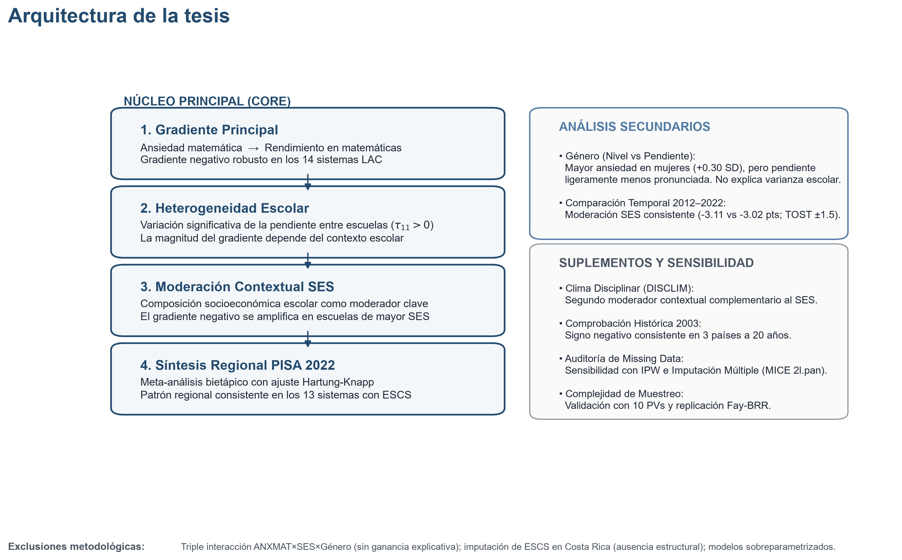
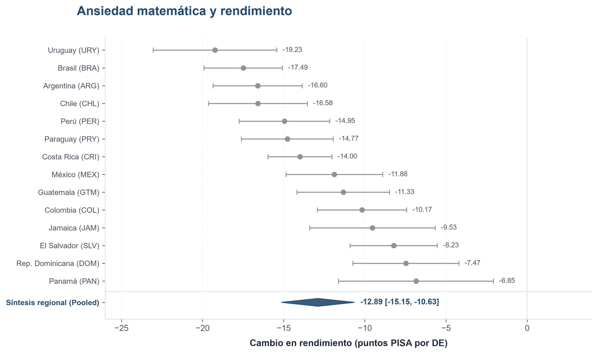
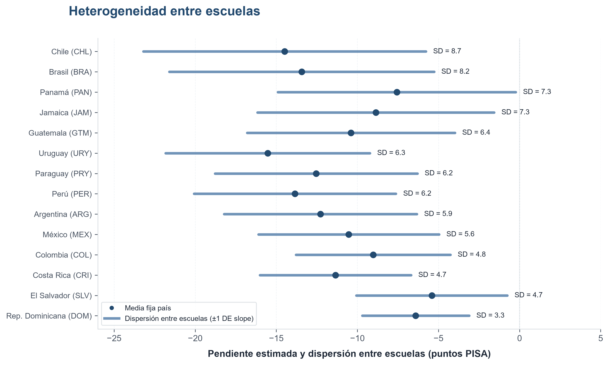
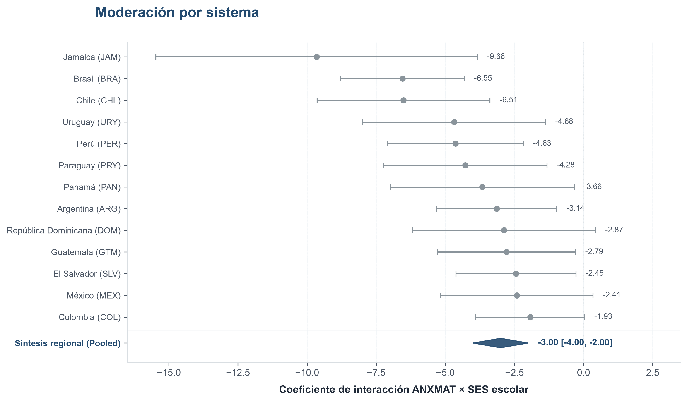
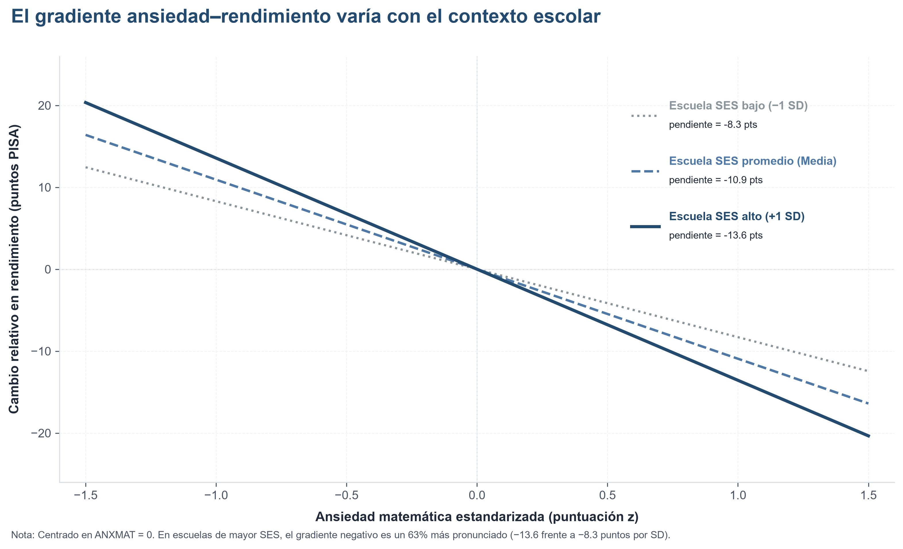
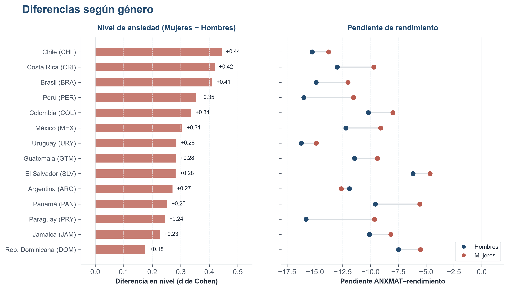
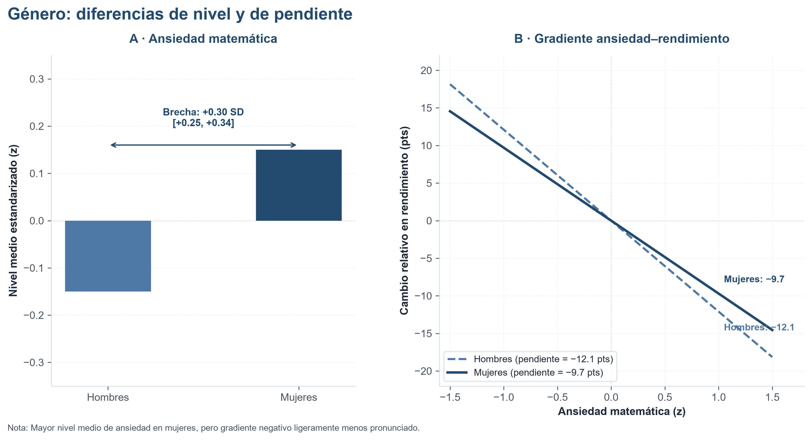
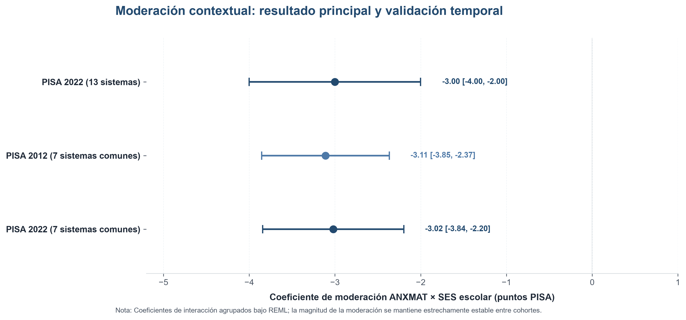
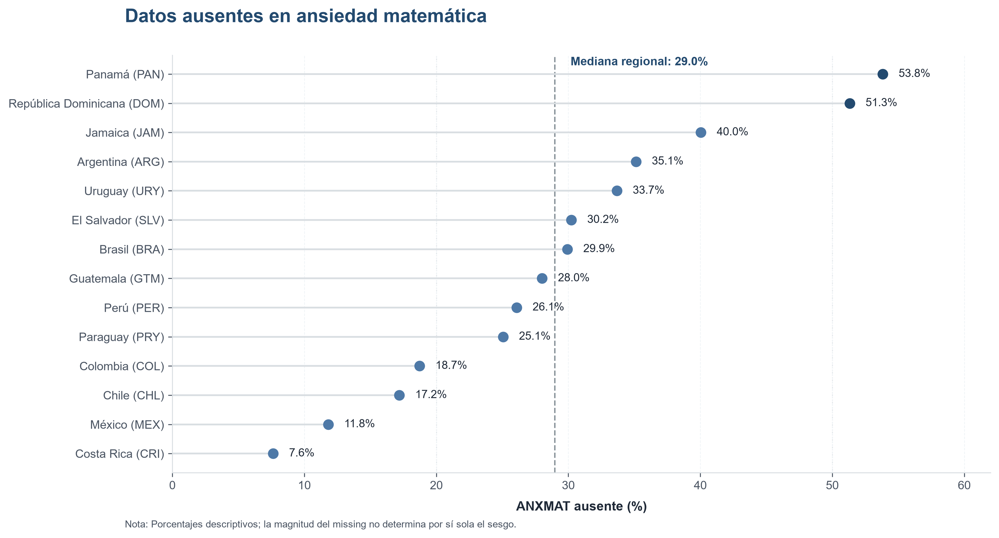
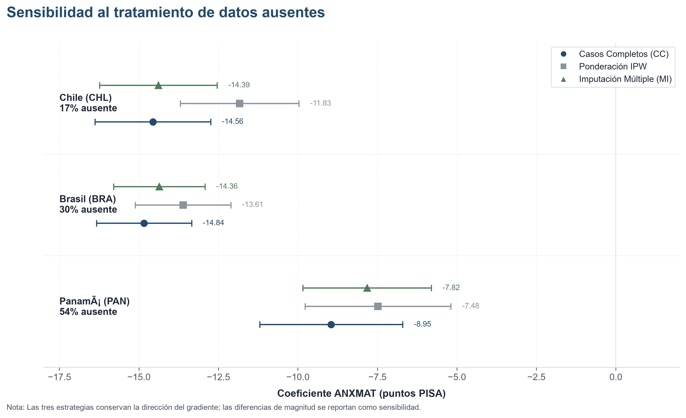

---
format:
  revealjs:
    theme: default
    css: visualizaciones.css
    width: 1600
    height: 900
    margin: 0.02
    min-scale: 0.2
    max-scale: 2.0
    slide-number: false
    progress: false
    controls: false
    controls-tutorial: false
    transition: none
    background-transition: none
    center: true
    touch: true
    keyboard: true
    overview: false
    menu: false
    navigation-mode: linear
---

## {.title-slide}

::: {.title-wrapper}
[Seminario de Investigación II]{.title-category}

[Heterogeneidad de la asociación entre ansiedad
matemática y rendimiento matemático según la
composición socioeconómica escolar en América Latina y
el Caribe]{.title-main}

[PISA 2022 · América Latina y el Caribe]{.title-sub}
:::

## {.figure-slide}

## Planteamiento del problema {.content-slide}

:::: {.problem-grid}

::: {.problem-item}
[01]{.problem-number}
[Aprendizaje matemático y desigualdad]{.problem-title}
[Resultados de aprendizaje socialmente desiguales entre estudiantes, escuelas y sistemas educativos.]{.problem-text}
:::

::: {.problem-item}
[02]{.problem-number}
[Ansiedad matemática y rendimiento]{.problem-title}
[La ansiedad matemática mantiene una asociación negativa ampliamente documentada con el rendimiento.]{.problem-text}
:::

::: {.problem-item}
[03]{.problem-number}
[Heterogeneidad contextual]{.problem-title}
[La magnitud de esa asociación no necesariamente es constante entre contextos educativos.]{.problem-text}
:::

::: {.problem-item}
[04]{.problem-number}
[Composición socioeconómica escolar]{.problem-title}
[El perfil socioeconómico de la escuela constituye una dimensión contextual distinta del SES individual.]{.problem-text}
:::

::: {.problem-item .problem-item-wide}
[05]{.problem-number}
[América Latina y el Caribe]{.problem-title}
[Una región con importantes desigualdades educativas y variación entre escuelas y sistemas.]{.problem-text}
:::

::::

::: {.problem-closure}
[De una asociación promedio]{.closure-part} [→]{.closure-arrow} [a su heterogeneidad entre contextos escolares]{.closure-part}
:::

## Brecha de conocimiento {.content-slide}

:::: {.gap-container}

:::: {.gap-known-grid}

::: {.gap-card}
[Sabemos que]{.gap-tag}
[La **ansiedad matemática** se asocia negativamente con el rendimiento y que esta relación presenta variación entre contextos educativos.]{.gap-text}
:::

::: {.gap-card}
[Sabemos también que]{.gap-tag}
[La **composición socioeconómica escolar** se relaciona con diferencias relevantes en los resultados educativos.]{.gap-text}
:::

::::

::: {.gap-focal-card}
[Por ende, es clave conocer]{.gap-focal-tag}
[si la **composición socioeconómica escolar** se relaciona específicamente con la magnitud de la asociación entre **ansiedad matemática y rendimiento**.]{.gap-focal-statement}
[Especialmente de manera comparativa entre los sistemas educativos de América Latina y el Caribe.]{.gap-focal-sub}
:::

::::

## Pregunta de investigación {.content-slide}

::: {.statement-card}
¿En qué medida la asociación entre **ansiedad matemática** y **rendimiento matemático** varía entre escuelas y sistemas educativos de América Latina y el Caribe, y cómo difiere según la **composición socioeconómica escolar** en PISA 2022?
:::

## Objetivo general {.content-slide}

::: {.statement-card}
Analizar la variación de la asociación entre **ansiedad matemática** y **rendimiento matemático** entre escuelas y sistemas educativos de América Latina y el Caribe, examinando si su magnitud difiere según la **composición socioeconómica escolar** en PISA 2022.
:::

## Objetivos específicos {.content-slide}

:::: {.objectives-grid}

::: {.objective-item}
[01]{.objective-num}
[Estimar y comparar la **dirección y magnitud** de la asociación entre ansiedad matemática y rendimiento matemático entre los sistemas educativos de la región.]{.objective-text}
:::

::: {.objective-item}
[02]{.objective-num}
[Examinar la **variación entre escuelas** de la magnitud de esta asociación.]{.objective-text}
:::

::: {.objective-item}
[03]{.objective-num}
[Examinar si la asociación ansiedad–rendimiento **difiere según la composición socioeconómica escolar**, distinguiendo el nivel socioeconómico individual del perfil socioeconómico de la escuela.]{.objective-text}
:::

::: {.objective-item}
[04]{.objective-num}
[Examinar las **diferencias de género** en ansiedad matemática y si la asociación ansiedad–rendimiento difiere entre mujeres y hombres.]{.objective-text}
:::

::: {.objective-item}
[05]{.objective-num}
[Examinar la **estabilidad o cambio** de la moderación por composición socioeconómica escolar entre **PISA 2012 y PISA 2022**.]{.objective-text}
:::

::::

## Hipótesis principales {.content-slide}

:::: {.hypothesis-list}

::: {.hypothesis-item}
[H1]{.hypothesis-id}
[Mayor **ansiedad matemática** se asociará con **menor rendimiento matemático**.]{.hypothesis-content}
:::

::: {.hypothesis-item}
[H2]{.hypothesis-id}
[La magnitud de la asociación ansiedad–rendimiento presentará **heterogeneidad entre escuelas y sistemas educativos**.]{.hypothesis-content}
:::

::: {.hypothesis-item}
[H3]{.hypothesis-id}
[La magnitud de la asociación ansiedad–rendimiento **diferirá según la composición socioeconómica escolar**. Hipótesis no direccional]{.hypothesis-content}
:::

::::

## Análisis secundarios {.content-slide}

:::: {.hypothesis-list}

::: {.hypothesis-item}
[H4a]{.hypothesis-id}
[Las mujeres presentarán, en promedio, **mayores niveles de ansiedad matemática** que los hombres.]{.hypothesis-content}
:::

::: {.hypothesis-item}
[H4b]{.hypothesis-id}
[La magnitud de la asociación ansiedad–rendimiento **diferirá según género**. Hipótesis no direccional]{.hypothesis-content}
:::

::::

## {.figure-slide}

## {.figure-slide}

## {.figure-slide}

## {.figure-slide}

## {.figure-slide}

## {.figure-slide}

## {.figure-slide}

## {.figure-slide}

## {.figure-slide}

